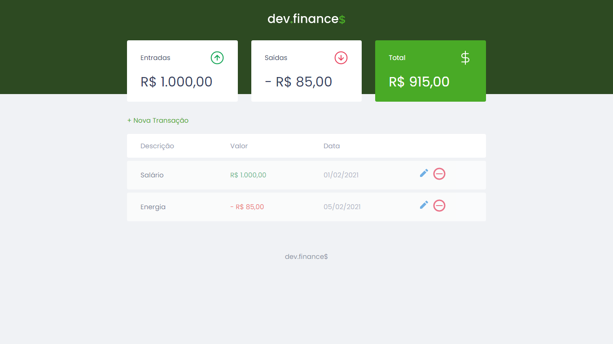

    

  <a href="#-tecnologias">Tecnologias</a>&nbsp;&nbsp;&nbsp;|&nbsp;&nbsp;&nbsp;
  <a href="#-projeto">Projeto</a>&nbsp;&nbsp;&nbsp;|&nbsp;&nbsp;&nbsp;
  <a href="#-layout">Layout</a>&nbsp;&nbsp;&nbsp;|&nbsp;&nbsp;&nbsp;
  <a href="#-licença">Licença</a>

 

    

 

## 🚀 TECNOLOGIAS

Esse projeto foi desenvolvido com as seguintes tecnologias:

- HTML
- CSS
- JavaScript

 

## 💻 PROJETO

O dev.finance$ é uma aplicação Web de controle financeiro, onde é possível cadastrar, editar e excluir transações (contendo descrião, valor e data) e ver o saldo de entrada, saída e total acumulado.

 

## 🔖 LAYOUT

Visualize o layout do projeto através [desse link](https://www.figma.com/file/7Vu9DzUaCZIV4nibzkjgB4/dev.finance%24-Maratona-Discover). É necessário ter conta no [Figma](https://figma.com) para acessá-lo.

 

## 📝 LICENÇA
Esse projeto está sob a licença MIT. Veja o arquivo [LICENSE](LICENSE.md) para mais detalhes.

 

---

    Feito por Fernando Oliveira Lopes durante a Primeira Edição da Maratona Discover, da Rocketseat, que ocorreu de 14/01/2021 à 04/02/2021.

Visite: 
 
[Rocketseat](https://rocketseat.com.br/)
 
[Maratona Discover](https://maratonadiscover.rocketseat.com.br/)
